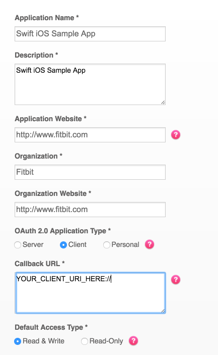
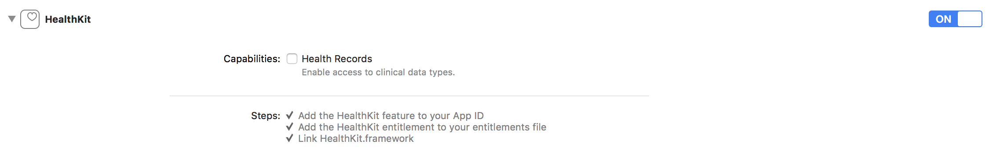

# Let's Nurture
[www.letsnurture.com](https://www.letsnurture.com)

Let's Nurture is a registered company in UK & India providing Mobile , Web & Digital Marketing Consulting And Development Services. 
# iPhone App Development
[iPhone App Development](https://www.letsnurture.com/services/iphone-app-development.html)

[](http://twitter.com/LetsNurture)
[](https://www.facebook.com/LetsNurture)

# Fitbit-OAuth-Swift
Hey guys! Here's a project I was working on for iOS that connects with the Fitbit API. Becuase of some limitations set by Apple, I can't program a native app with the functionality I wanted. 

#Fitbit OAuth Swift Boot Demo

This app deals with the boilerplate code of using the Fitbit API with iOS Swift, authenticating via OAuth and making a simple API call. It is meant as a starting point for more robust applications and a demonstration of some of the basic concepts of the API. Swift 4.2 with Xcode 10.1 is preferred, though 

[Install Xcode 10.1](https://developer.apple.com/download/more/)

[Read More About the Fitbit API](https://dev.fitbit.com/docs/)

##Prerequisites
This document assumes you have Xcode 10.1 and Swift 4.2 installed. A tutorial for installing these is out of scope for this project, but there are many resources to instruct you on how to do so.

## Developing Your Own App

First fork this repo

Then create a [Fitbit App Config](https://dev.fitbit.com/apps/new). 

This is the config I used while developing. Your app may not need read/write access.



Once you have setup your app you need to put the client ID and client secret into the application config. You should be able to find both of these on the [manage apps page](https://dev.fitbit.com/apps). These values should be placed in FitBitPOC/FitBitClass/AppConstant.swift.


# Apple-Health-Swift
There's a sunc button that will request Authorization for permition and allow you to access HealthKit data and then step count will be populated with current date.

HealthKit is not supported on all iOS devices.  Using HKHealthStore APIs on devices which are not
supported will result in errors with the HKErrorHealthDataUnavailable code.  Call isHealthDataAvailable
before attempting to use other parts of the framework.

Add permition in info.plist


```
<key>NSHealthShareUsageDescription</key>
<string>This app share your helth data.</string>
<key>NSHealthUpdateUsageDescription</key>
<string>This app requires to access your helth data.</string>
```


Enable switch on in XCode Capabilities




